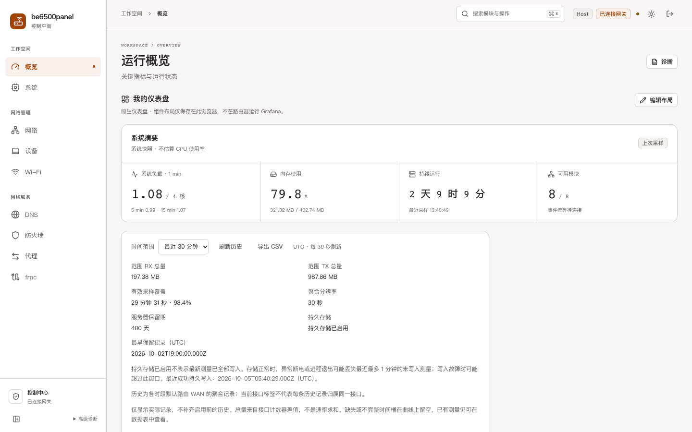
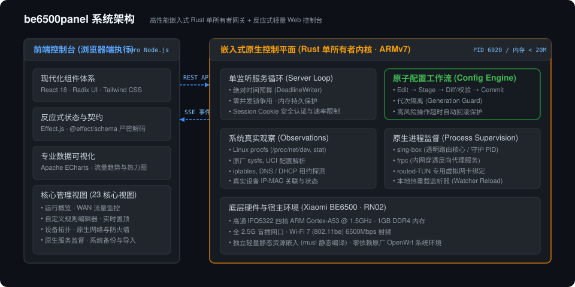
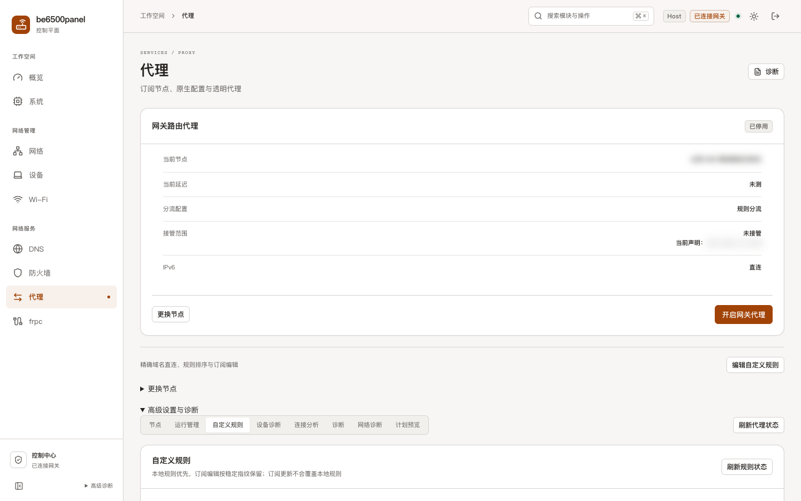
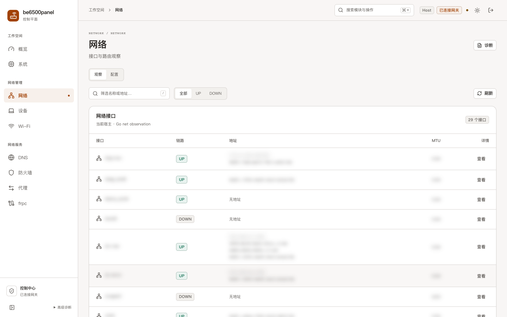
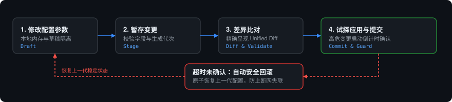

<div align="center">

# be6500panel

**小米路由器 BE6500 (RN02) 嵌入式网关控制中心**

面向高通 IPQ5322 硬件平台的现代化 Web 管理控制台与轻量 Rust 原生控制平面

<p align="center">
  <a href="https://www.rust-lang.org/"></a>
  <a href="https://react.dev/"></a>
  
  
  <a href="LICENSE"></a>
</p>

<p align="center">
  <a href="#核心特性">核心特性</a> •
  <a href="#系统架构">系统架构</a> •
  <a href="#界面预览">界面预览</a> •
  <a href="#配置管理工作流">配置工作流</a> •
  <a href="#本地开发与构建">本地开发</a> •
  <a href="#部署与运行规格">部署规格</a>
</p>

<br />



</div>

---

## 项目简介

be6500panel 针对小米路由器 BE6500（RN02）硬件特性定制，旨在提供兼顾稳定、低资源占用与现代交互体验的网关管理环境。系统由两部分组成：

- **嵌入式控制平面 (Rust)**：单监听、绝对时间预算的常驻服务，管理系统状态、UCI 接口与守护进程（sing-box、frpc），实测内存占用约为 5–7 MiB。
- **Web 前端控制台 (React 19)**：基于 Tailwind CSS、Radix UI 与 Apache ECharts 构建的高信息密度管理界面，静态资源由 Rust 服务直接托管，路由器无需 Node.js 环境。

---

## 核心特性

- **轻量原生内核**：基于 Rust 实现单所有者服务循环，提供毫秒级就绪与代次管理，严格隔离资源开销。
- **智能分流管理**：
  - 本地解析节点订阅，凭据不经由外部托管；
  - 支持 VLESS、REALITY、Vision、uTLS 等主流协议；
  - 独立规则编辑器，支持精确域名直连与订阅规则按内容指纹保留改写；
  - 基于 routed-TUN 虚拟网卡实现网关级分流接管。
- **系统遥测与网络观察**：
  - 基于 `/proc/net/dev` 计数器差值提供 2.5G 物理接口双向速率统计；
  - 基于 DHCP 租约与 ARP 缓存被动观察局域网在线设备及 IP-MAC 关联；
  - 实时查看 IPv4 / IPv6 系统路由表与原厂防火墙规则状态。
- **进程监督与内网穿透**：
  - 接入 `procd` 与 `/proc` 状态，支持系统后台服务的启停与重启；
  - 原生监管 frpc 进程，支持本地 TOML 配置文件与进程自愈。
- **配置防失联保护**：
  - 实行 `编辑 → 暂存 → 差异比对 → 提交` 的完整版本生命周期；
  - 关键网络变更采用试探性应用，超时未确认自动安全回滚至上一代稳定配置。

---

## 系统架构

<div align="center">
  
</div>

- **浏览器控制台**：纯静态前端资源，由嵌入式 HTTP 服务直接对外挂载；
- **通信接口**：基于 Session Cookie 认证的 HTTP API，配合 `/api/events` Server-Sent Events（SSE）事件流实时推送系统状态；
- **控制平面**：负责系统原生观察（procfs / sysfs / UCI）、配置版本引擎以及 sing-box、frpc 的本地进程生命周期。

---

## 界面预览

<table align="center" width="100%">
  <tr>
    <td width="50%" align="center">
      <a href="docs/images/overview-dashboard.png">
        
      </a>
      <br />
      <b>运行概览 (<code>/#/overview</code>)</b>
      <p align="left">实时展示系统平均负载（Load Average）、内存分布、WAN 流量历史趋势、终端活跃热力图与服务运行状态。</p>
    </td>
    <td width="50%" align="center">
      <a href="docs/images/proxy-rules-editor.png">
        
      </a>
      <br />
      <b>代理与规则管理 (<code>/#/proxy</code>)</b>
      <p align="left">节点切换、精确域名直连、订阅规则指纹改写、草稿保存、合并规则即时预览与一次确认生效流水线。</p>
    </td>
  </tr>
  <tr>
    <td colspan="2" align="center">
      <a href="docs/images/network-topology.png">
        
      </a>
      <br />
      <b>网络接口与局域网终端 (<code>/#/network</code>)</b>
      <p align="center">2.5G 网口物理状态统计、系统路由表与基于 DHCP/ARP 记录的局域网设备观察。</p>
    </td>
  </tr>
</table>

---

## 配置管理工作流

系统通过明确的状态机隔离草稿修改与生产运行时，避免误操作风险：

<div align="center">
  
</div>

1. **草稿隔离**：编辑过程仅保存在本地草稿，不触碰路由器实际系统配置；
2. **差异比对**：提供精确到行的统一差异（Unified Diff）视图，直观展示变更影响；
3. **超时保护**：管理连接变更试探性应用后启动倒计时，若未收到心跳确认，系统自动还原至上一代稳定配置。

---

## 本地开发与构建

项目采用标准 **Rust + Bun** 单代码库（MonoRepo）组织，无需额外构建链路。

### 环境准备

- **Rust**：1.93 或更高版本（包含 `cargo`）
- **Bun**：1.0+（前端依赖管理与脚本执行）
- **Node.js**：20.20+（开发工具链环境）

### 常用命令

```bash
# 1. 安装前端依赖
make setup

# 2. 启动本地开发服务（回环只读模式，监听 127.0.0.1:8790）
make dev-api

# 3. 另起终端启动前端开发服务器（带热重载）
make dev-web

# 4. 执行全套测试（前端单测与类型检查、Rust 单元与集成测试）
make test

# 5. 构建本地运行二进制与前端静态产物
make build

# 6. 交叉编译目标路由器平台产物（ARMv7 musl 静态二进制）
make armv7
```

### 原生 Cargo 命令

```bash
# 运行全部 Rust 单元测试与代码检查
cargo test --locked
cargo fmt --check
cargo clippy --locked -- -D warnings

# 构建优化后的发布版本
cargo build --release --locked
```

---

## 目录结构

```text
be6500panel/
├── Cargo.toml          # Rust 根配置与依赖声明
├── Cargo.lock          # 依赖版本锁定文件
├── Makefile            # 标准化开发、测试、构建与交叉编译入口
├── src/                # 嵌入式控制平面源码 (Rust)
│   ├── main.rs         # 入口点与参数解析
│   ├── server.rs       # HTTP / SSE 监听服务与请求路由
│   ├── product_*.rs    # 系统观察、配置、网络与网关逻辑
│   └── capture_*.rs    # routed-TUN 接管状态机实现
├── web/                # 现代化前端工程 (React 19 / Vite / Tailwind)
│   ├── src/app/        # 页面路由与主框架 Shell
│   ├── src/modules/    # 业务模块（代理、网络、系统、设备、FRPC）
│   ├── src/components/ # 视觉组件、配置表单与可视化图表
│   └── src/lib/        # API 客户端与强类型数据契约
├── tests/              # 跨模块端到端与集成测试套件
│   └── fixtures/       # 原生回归测试基准数据 (native, subscription, capture, local-policy)
├── examples/           # 独立验证工具与示例程序
└── docs/               # 架构设计与技术文档
    └── images/         # 架构图解与产品真实截图
```

---

## 部署与运行规格

| 维度 | 规格说明 |
| :--- | :--- |
| **目标机型** | 小米路由器 BE6500（RN02），高通 IPQ5322 四核 ARM Cortex-A53 @ 1.5GHz |
| **底层系统** | 原厂 QSDK / OpenWrt Linux（内核 5.4） |
| **运行路径** | `/tmp/be6500panel/boot-release/be6500-panel`（同级挂载 `web/` 静态目录） |
| **持久存储** | `/data/be6500panel/panel.tar.gz`（持久包与配置备份） |
| **内存指标** | 管理器服务（Rust）驻留内存约为 5–7 MiB（不含 sing-box 独立核心） |
| **验证标准** | 23 个核心视图通过零告警验证（0 Alerts, 0 Page Errors, 0 API 失败），12 项浏览器自动化行为验证通过 |

---

## 开源许可

本项目采用 [MIT 许可证](LICENSE)。
